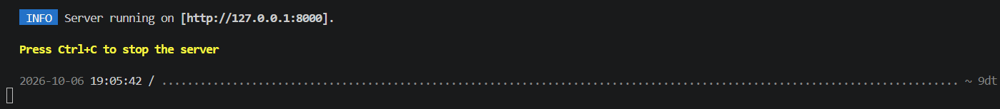
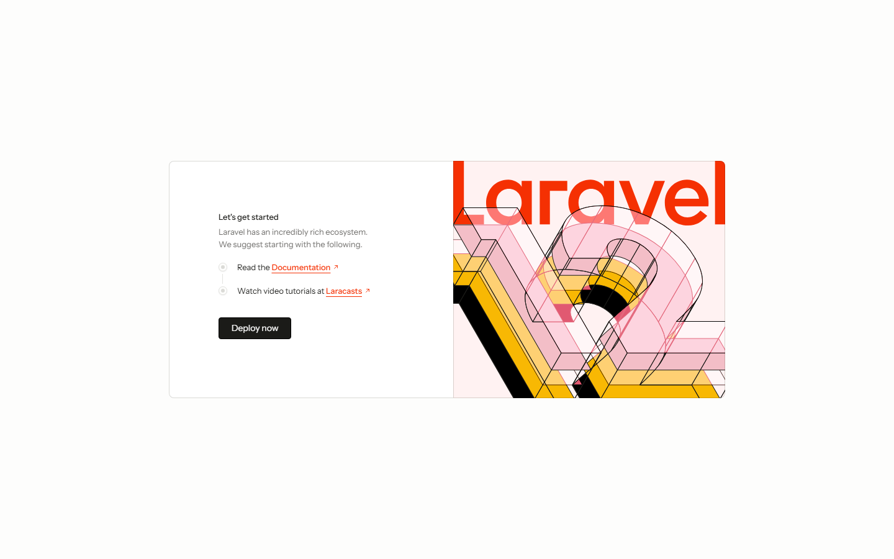
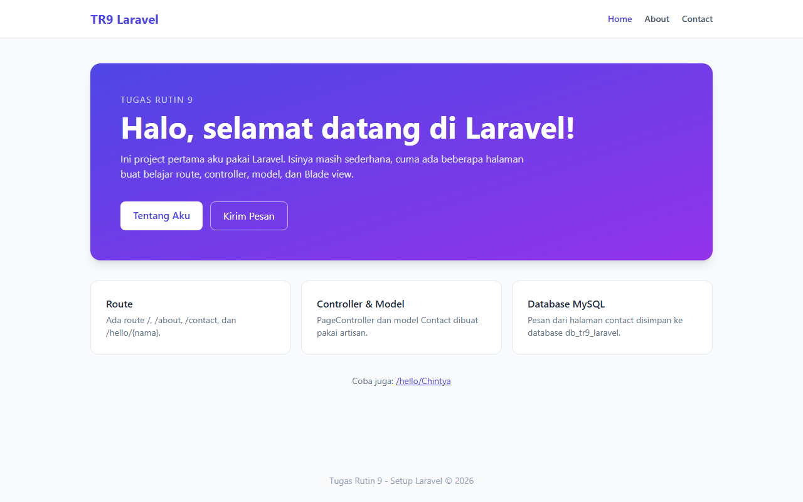
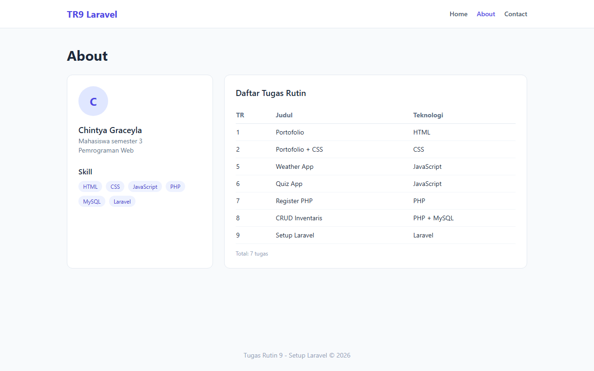
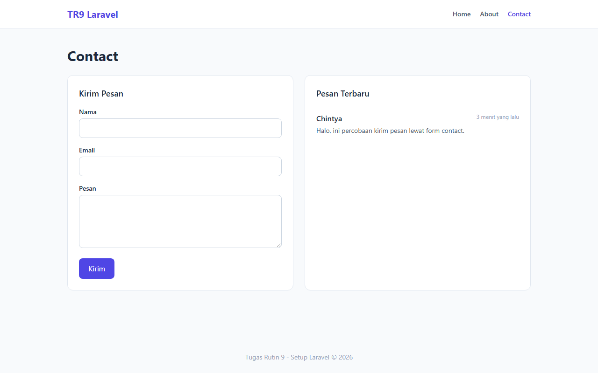
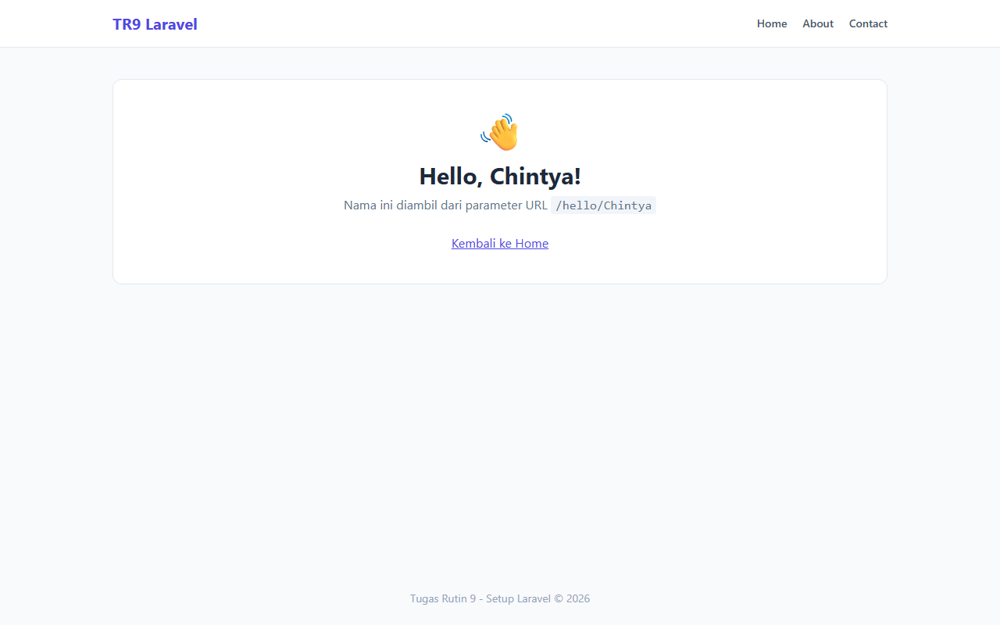

# TugasWeb-P9-LaravelSetup

Tugas Rutin 9 - Setup Laravel. Project ini isinya instalasi Laravel, koneksi ke database MySQL, dan beberapa halaman sederhana pakai route, controller, model, dan Blade view.

- Laravel 12
- PHP 8.2 (XAMPP)
- MySQL / MariaDB (XAMPP)
- Tailwind CSS (CDN)

## Screenshot

`php artisan serve` berjalan:



Welcome page bawaan Laravel waktu pertama kali dijalankan:



Halaman setelah dibuat:

| Home | About |
|---|---|
|  |  |

| Contact | Hello |
|---|---|
|  |  |

## Langkah Install

### 1. Install Composer
Download Composer di https://getcomposer.org/download/ lalu install. Cek apakah sudah berhasil:
```bash
composer --version
```

### 2. Buat project Laravel
```bash
composer create-project laravel/laravel TugasWeb-P9-LaravelSetup
cd TugasWeb-P9-LaravelSetup
```

### 3. Buat database
Nyalakan Apache & MySQL di XAMPP, buka `http://localhost/phpmyadmin`, lalu buat database baru dengan nama `db_tr9_laravel`.

### 4. Konfigurasi `.env`
Default Laravel 12 pakai sqlite, jadi diganti ke mysql:
```env
DB_CONNECTION=mysql
DB_HOST=127.0.0.1
DB_PORT=3306
DB_DATABASE=db_tr9_laravel
DB_USERNAME=root
DB_PASSWORD=
```

### 5. Jalankan migration
```bash
php artisan migrate
```

### 6. Jalankan server
```bash
php artisan serve
```
Buka `http://127.0.0.1:8000` di browser.

### Kalau clone dari GitHub
```bash
git clone https://github.com/graceyla/TugasWeb-P9-LaravelSetup.git
cd TugasWeb-P9-LaravelSetup
composer install
copy .env.example .env
php artisan key:generate
php artisan migrate
php artisan serve
```
(jangan lupa buat database `db_tr9_laravel` dulu di phpMyAdmin)

## Route

| Method | URL | Keterangan |
|---|---|---|
| GET | `/` | Home (welcome page, styling pakai Tailwind CDN) |
| GET | `/about` | About, data array dikirim dari route ke view |
| GET | `/contact` | Form contact + daftar pesan terbaru dari database |
| POST | `/contact` | Simpan pesan (pakai validasi) |
| GET | `/hello/{nama}` | Bonus: route parameter, contoh `/hello/Chintya` |

## Artisan yang dipakai
```bash
php artisan make:controller PageController
php artisan make:model Contact -m
php artisan migrate
```
`make:model Contact -m` bikin model `Contact` sekalian file migration untuk tabel `contacts` (kolom nama, email, pesan).

## Struktur Folder

```
TugasWeb-P9-LaravelSetup/
├── app/
│   ├── Http/Controllers/
│   │   └── PageController.php   -> controller untuk home, contact, hello
│   └── Models/
│       └── Contact.php          -> model untuk tabel contacts
├── bootstrap/                   -> file untuk booting framework
├── config/                      -> konfigurasi (database, app, session, dll)
├── database/
│   └── migrations/              -> struktur tabel database
├── public/                      -> folder yang diakses browser (index.php, asset)
├── resources/
│   └── views/                   -> file Blade (tampilan)
│       ├── layouts/app.blade.php  -> layout utama (navbar + footer)
│       ├── welcome.blade.php
│       ├── about.blade.php
│       ├── contact.blade.php
│       └── hello.blade.php
├── routes/
│   └── web.php                  -> daftar route
├── storage/                     -> log, cache, file upload
├── vendor/                      -> library dari composer (tidak di-upload ke git)
├── .env                         -> konfigurasi environment (tidak di-upload ke git)
├── artisan                      -> CLI Laravel
└── composer.json                -> daftar package
```

Alurnya (MVC): request masuk ke `routes/web.php` → diteruskan ke **Controller** → controller ambil data lewat **Model** kalau perlu → hasilnya dikirim ke **View** (Blade) untuk ditampilkan.
